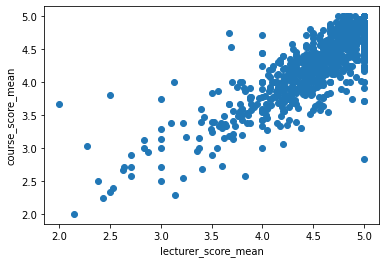
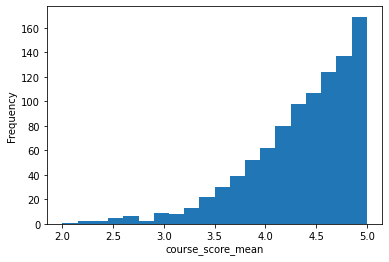
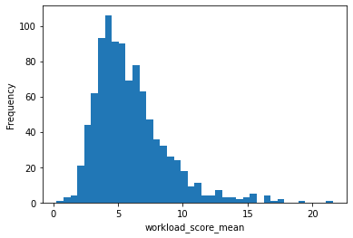

# Harvard Gems


Web scrapper, data analysis and [website](https://jeqcho.github.io/harvard-gems) for the best classes at Harvard.


If you found it useful, you can

[](https://www.buymeacoffee.com/jeqcho)

## Further analytics

Course ratings correlate well with recommendation score.


Course ratings also correlate well with lecturer scores, but with more scatter.



Sentiment analysis on the course comments also agree well with its average course rating.


Most high-scoring courses have low workload.


Harvard classes tend to have high ratings. It is rare to get a low score.



Most Harvard classes have a workload demand of around 5 hours per week outside of classes, though the distribution is skewed so some classes have much higher workloads.



There is little correlation between the number of students in the class and the score of the class.


More analysis, and the code for the graphs can be found through this [Colab Notebook](https://colab.research.google.com/drive/1WR3_DSCN_aL7l6b5yqrqto8116Ktb_TY?usp=sharing). A copy of
the notebook is also available in the repo above as `course_ratings_analysis.ipynb`. Remember to upload `verbose_course_ratings.csv` if you hope to tinker around.

## Website
The code for the website can be found at [this repo](https://github.com/jeqcho/harvard-gems). This repo is for the scrapping and analytics.

## Installation

If you use a virtual environment, please specify Python 3.11 for numpy compatibility

```bash
conda create -n harvard-gems python=3.11
conda activate harvard-gems
```

Then install the requirements

`pip install -r requirements.txt`

## Usage

You probably don't need to follow the steps below since the results can be found at `verbose_course_ratings.csv`, but
this is a step-by-step guide on how to create that csv from scratch.

1. Download the webpage from the link in `scrapper.py` as a HTML-only file named`QReports.html`. Run `scrapper.py` to scrape the links for the QGuides for each course. The links generated will be stored at `courses.csv`.
2. Visit any QGuide links scrapped at `courses.csv` to get the cookies (see the code of `downloader.py` for the search term `secret_cookie`) and paste it at a new file named `secret_cookie.txt`. Note that using the current VScode reader for CSV will open a defunct link with other columns suffixed. Manually copy the link and paste it in your browser. Run `downloader.py` to download all the QGuides with the links scrapped from the previous step. The QGuides will be
   stored at the folder `QGuides`.
3. Run `analyzer.py` to generate `course_ratings.csv`.
4. Now we have to add details like divisional requirement or whether it fulfils quantitative reasoning with data (QRD),
   but most importantly we need to know whether this class is offered in Fall 2024 (the QGuides are for Fall 2023). First clear the `not-offered.txt`. You might need to install Selenium for this step, but first try running `myharvarddriver.py` to use Selenium to get these necessary details from my.harvard.edu. Depending on your machine, you might need more setup to use Selenium, so you can check out the official guide or see my notes below. Make sure to edit `driver_path`. The webpages for each class will be stored as HTML files at the folder `myharvard`. This should be the step that takes the longest (around 1.5 hours), I usually leave it running overnight.
   - If you need more setup, download it [here](https://googlechromelabs.github.io/chrome-for-testing/#stable). Remember to download the chromedriver and not chrome.
   - Run this in the folder `xattr -d com.apple.quarantine chromedriver`
   - You should be able to run it now.
5. New in 2024 Fall, some classes have sections to be chosen during registration, like CHNSE 130 and EXPOS 40. Run `rescrape.py` to handle these cases which require an additional click.
   - Simply rerun the file if there are errors. It will pick up those courses that are not done.
6. Process these webpages to get the data by running `append_details.py`. This will generate `verbose_course_ratings.csv` as required.
7. Start a Jupyter notebook session (`jupyter notebook`) and choose `course_ratings_analysis.ipynb` to run. This will generate the graphs above and the data at `output_data`. Follow through the notebook and play around!
8. If you are maintaining this repo, then please make a folder under archive for the upcoming semester, and then put the following files there: `course_ratings.csv`, `courses.csv`, `not-offered.txt`, `QReports.html`, `verbose_course_ratings.csv`.
