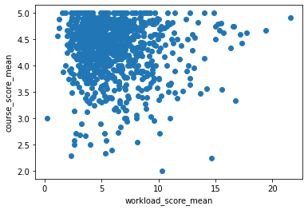

# Harvard Gems

Web scrapper, data analysis and [website](jeqcho.github.io/harvard-gems).

If you found it useful, you can

## Installation

`pip install -r requirements.txt`

## Usage

You probably don't need to follow the steps below since the results can be found at `verbose_course_ratings.csv`, but
this is a step-by-step guide on how to create that csv from scratch.

1. Run `scrapper.py` to scrape the links for the QGuides from `QReports.html`. The link to the HTML file is available
   in `scrapper.py`. The links generated will be stored at `courses.csv`.
2. Run `downloader.py` to download all the QGuides with the links scrapped from the previous step. The QGuides will be
   stored at the folder `QGuides`.
3. Run `analyzer.py` to generate `course_ratings.csv`.
4. Now we have to add details like divisional requirement or whether it fulfils quantitative reasoning with data (QRD),
   but most importantly we need to know whether this class is offered in Spring 2023 (the QGuides are for Spring 2022).
   Run `myharvarddriver.py` to use Selenium to get these necessary details from my.harvard.edu. Depending on your
   machine, you might need more setup to use Selenium, so you can check out the official guide. The webpages for each
   class will be stored as HTML files at the folder `myharvard`.
5. Process these webpages to get the data by running `myharvardscrapper.py`. This will generate `verbose_course_ratings.csv` as required.

## Further analytics

Course ratings correlate well with recommendation score
.

Course ratings also correlate well with lecturer scores, but with more scatter.

Sentiment analysis on the course comments also agree well with its average course rating.

Most high-scoring courses have low workload.

Harvard classes tend to have high ratings. It is rare to get a low score.

Most Harvard classes have a workload demand of around 5 hours per week outside of classes, though the distribution is skewed so some classes have much higher workloads.

There is little correlation between the number of students in the class and the score of the class.

More analysis, and the code for the graphs can be found through this [Colab Notebook](https://colab.research.google.com/drive/1WR3_DSCN_aL7l6b5yqrqto8116Ktb_TY?usp=sharing). A copy of
the notebook is also available in the repo above as `course_ratings_analysis.ipynb`. Remember to upload `verbose_course_ratings.csv` if you hope to tinker around.

## Website
The code for the website can be found at [this repo](https://github.com/jeqcho/harvard-gems).